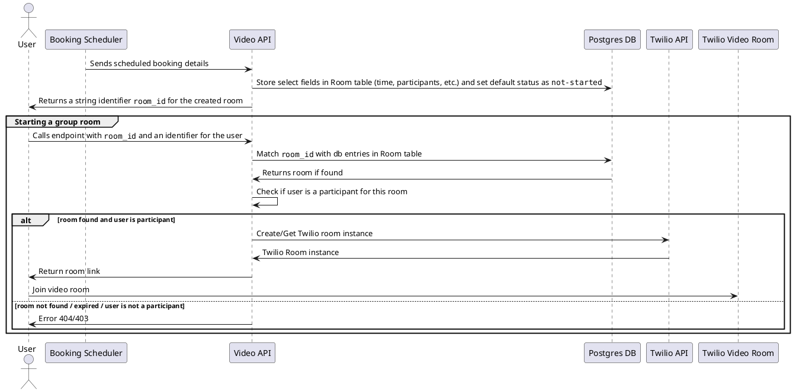
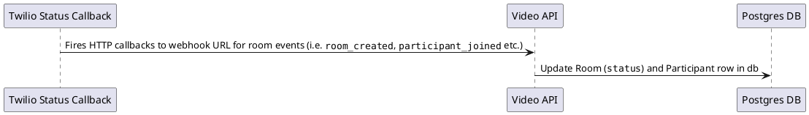
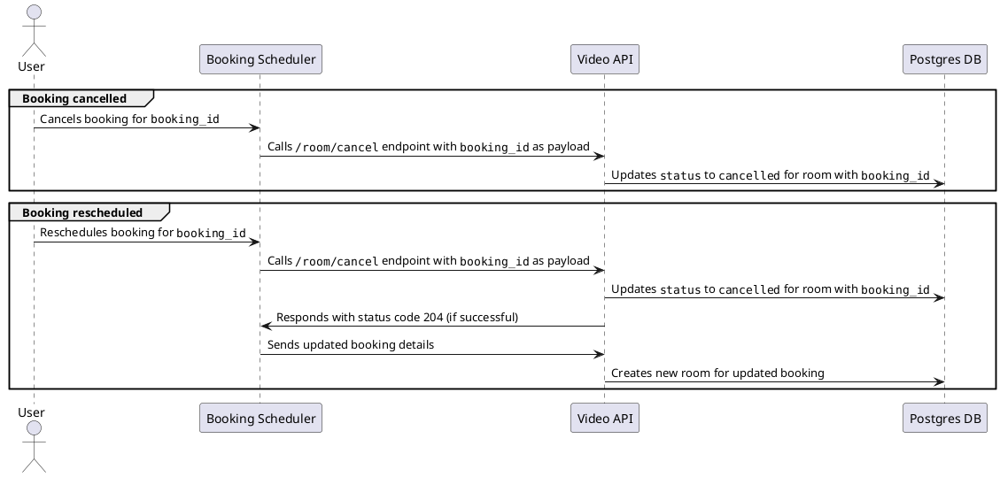

## Twilio Video Room SDK

#### Scheduling and creating a room

```plantuml

    @startuml

    actor User
    participant "Booking Scheduler" as Scheduler
    participant "Video API" as Backend
    participant "Postgres DB" as Database
    participant "Twilio API" as Twilio
    participant "Twilio Video Room" as VideoRoomLink

    Scheduler -> Backend: Sends scheduled booking details
    Backend -> Database: Store select fields in Room table (time, participants, etc.) and set default status as ""not-started""
    Backend -> User: Returns a string identifier ""room_id"" for the created room

    group Starting a group room
        User -> Backend: Calls endpoint with ""room_id"" and an identifier for the user

        Backend -> Database: Match ""room_id"" with db entries in Room table
        Database -> Backend: Returns room if found
        Backend -> Backend: Check if user is a participant for this room

        alt room found and user is participant
            Backend -> Twilio: Create/Get Twilio room instance
            Twilio -> Backend: Twilio Room instance
            Backend -> User: Return room link
            User -> VideoRoomLink: Join video room
        else room not found / expired / user is not a participant
            Backend -> User: Error 404/403
        end
    end
    @enduml
```

#### Updating status for Twilio event callbacks

```plantuml
    @startuml

    participant "Twilio Status Callback" as Twilio
    participant "Video API" as Backend
    participant "Postgres DB" as Database

    Twilio -> Backend: Fires HTTP callbacks to webhook URL for room events (i.e. ""room_created"", ""participant_joined"" etc.)
    Backend -> Database: Update Room (""status"") and Participant row in db

    @enduml
```

#### Responding to changes in booking schedule

```plantuml
    @startuml

    actor User
    participant "Booking Scheduler" as Scheduler
    participant "Video API" as Backend
    participant "Postgres DB" as Database

    group Booking cancelled
    User -> Scheduler: Cancels booking for ""booking_id""
    Scheduler -> Backend: Calls ""/room/cancel"" endpoint with ""booking_id"" as payload
    Backend -> Database: Updates ""status"" to ""cancelled"" for room with ""booking_id""
    end

    group Booking rescheduled
    User -> Scheduler: Reschedules booking for ""booking_id""
    Scheduler -> Backend: Calls ""/room/cancel"" endpoint with ""booking_id"" as payload
    Backend -> Database: Updates ""status"" to ""cancelled"" for room with ""booking_id""
    Backend -> Scheduler: Responds with status code 204 (if successful)
    Scheduler -> Backend: Sends updated booking details
    Backend -> Database: Creates new room for updated booking
    end

    @enduml
```
